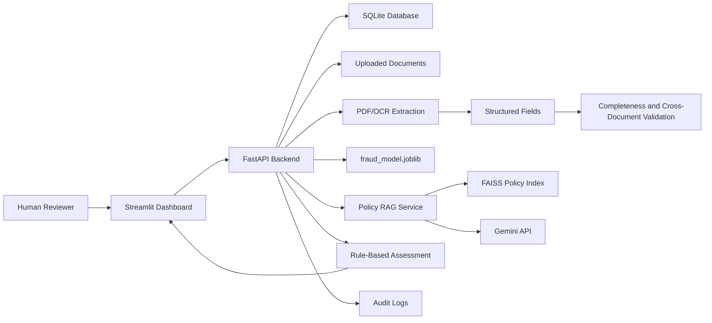
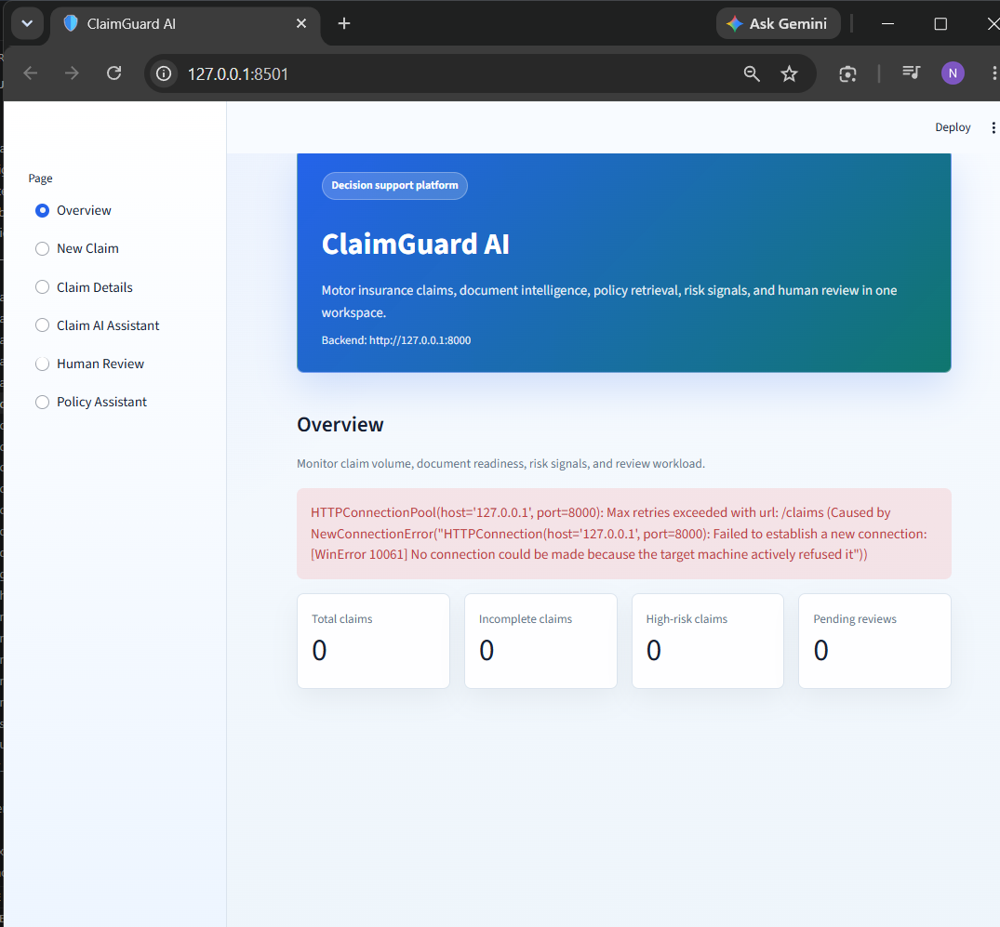

# ClaimGuard AI

Intelligent motor-insurance claim decision-support platform for demo
and educational use.

ClaimGuard AI combines a trained fraud-risk model, policy PDF RAG,
document upload and extraction, structured field parsing,
cross-document validation, human review, audit logging, and a
Streamlit dashboard.

## Important Disclaimer

This project uses synthetic/demo data. Fraud scores are decision-support
signals, not proof of fraud. Policy answers are not legal advice. The
system must not automatically approve or reject real insurance claims.
It is not validated for production insurance decisions.

## Project Status

The implementation is feature-complete for the local MVP/demo scope.
See [docs/final_quality_check.md](docs/final_quality_check.md) for
verified checks, local run commands, and external runtime blockers.

## Problem Statement

Motor insurance claim review often requires teams to inspect many
documents, compare policy and vehicle details, identify missing
evidence, and judge whether a claim needs ordinary review, correction,
policy review, or investigation. ClaimGuard AI provides a structured
assistant workflow for this review process while keeping a human
reviewer in control.

## Objective

The platform helps reviewers:

- Predict fraud risk using an existing trained ML pipeline.
- Ask policy questions against indexed motor-insurance PDFs with source
  and page citations.
- Upload claim PDFs and images securely.
- Extract text using direct PDF extraction with OCR fallback.
- Extract structured fields using deterministic parsing.
- Check required document completeness.
- Detect cross-document inconsistencies.
- Generate a consolidated claim assessment.
- Record human review decisions and corrections.
- Maintain a structured audit trail.

## Architecture



## Technology Stack

- Python 3.11
- FastAPI
- Streamlit
- SQLite with SQLAlchemy
- pandas, scikit-learn, joblib
- PyMuPDF, Pillow, EasyOCR
- FAISS and Sentence Transformers
- Gemini API for grounded policy answers
- pytest
- Docker Compose
- GitHub Actions
- Kubernetes manifests

## Core Features

- Fraud-risk prediction endpoint using `models/fraud_model.joblib`.
- Claim registry with SQLite persistence.
- Secure PDF/image upload validation.
- Text extraction saved under `data/extracted/`.
- Structured field extraction saved under `data/fields/`.
- Required-document completeness checker.
- Cross-document validation rules.
- Risk assessment from claim metadata, extracted fields, and manual
  model features.
- Policy RAG answer and retrieval endpoints.
- Consolidated claim assessment.
- Claim-aware AI assistant with deterministic mode, optional Gemini,
  and optional policy RAG context.
- Human review decisions and field corrections.
- Structured audit logging.
- Streamlit dashboard for review workflows.

## Setup

Create and activate a Python 3.11 virtual environment:

```bash
py -3.11 -m venv .venv
.venv\Scripts\activate
```

Install dependencies:

```bash
python -m pip install --upgrade pip
python -m pip install -r requirements.txt
```

Create local environment configuration:

```bash
copy .env.example .env
```

Fill in `GEMINI_API_KEY` only if you want live policy-answer
generation. Unit tests do not require Gemini.

VS Code-specific setup is documented in [docs/vscode.md](docs/vscode.md).
Common Windows setup errors are covered in
[docs/troubleshooting.md](docs/troubleshooting.md).

### Windows Venv Repair

If package imports fail with messages mentioning `cp312-win_amd64`
inside a Python 3.11 environment, or Pillow fails with
`cannot import name '_imaging'`, recreate the virtual environment:

```powershell
.\scripts\setup_windows.ps1 -RecreateVenv
```

This removes only `.venv`, recreates it with Python 3.11, installs
dependencies, checks packages, creates `.env` if missing, and generates
demo data.

If the Windows Python launcher is not registered, pass the Python 3.11
executable explicitly:

```powershell
.\scripts\setup_windows.ps1 -RecreateVenv -PythonPath "C:\Users\Admin\AppData\Local\Programs\Python\Python311\python.exe"
```

## Environment Variables

| Variable | Purpose | Default |
| --- | --- | --- |
| `APP_NAME` | Application display name | `ClaimGuard AI` |
| `APP_ENV` | Runtime environment label | `local` |
| `GEMINI_API_KEY` | Gemini API key for RAG answer generation | empty |
| `GEMINI_MODEL` | Gemini model name | `gemini-3.6-flash` |
| `DATABASE_URL` | SQLAlchemy database URL | `sqlite:///data/claimguard.db` |
| `MAX_UPLOAD_SIZE_MB` | Upload size limit | `10` |
| `OCR_ENABLED` | Enables OCR fallback | `true` |
| `OCR_LANGUAGES` | Comma-separated EasyOCR languages | `en` |
| `MAX_PDF_PAGES` | Maximum uploaded PDF pages | `50` |
| `MAX_IMAGE_WIDTH` | Maximum uploaded image width | `8000` |
| `MAX_IMAGE_HEIGHT` | Maximum uploaded image height | `8000` |
| `MAX_IMAGE_PIXELS` | Maximum uploaded image pixel count | `25000000` |
| `LOG_LEVEL` | Python logging level | `INFO` |
| `FRAUD_MODEL_PATH` | Trained fraud model path | `models/fraud_model.joblib` |
| `TRAINING_DATA_PATH` | Fraud training dataset path | `data/raw/fraud_oracle.csv` |
| `VECTOR_INDEX_PATH` | FAISS index path | `vector_store/policy.index` |
| `VECTOR_METADATA_PATH` | Policy chunk metadata path | `vector_store/policy_chunks.json` |
| `CORS_ALLOWED_ORIGINS` | Comma-separated frontend origins | `http://localhost:8501,http://127.0.0.1:8501` |
| `CLAIMGUARD_API_URL` | Streamlit backend URL | `http://localhost:8000` |

## Run The Backend

```powershell
.\scripts\run_backend.ps1
```

Open:

```text
http://127.0.0.1:8000/docs
```

## Run A Backend Smoke Test

After the backend is running, open another terminal and run:

```powershell
.\.venv\Scripts\python.exe .\scripts\smoke_test.py
```

The smoke test checks health, model feature metadata, claim creation,
claim lookup, document listing, completeness, validation, and RAG
readiness. Use `--skip-rag` if the FAISS policy index is not available.

## Run The Dashboard

Open a second VS Code terminal:

```powershell
.\scripts\run_frontend.ps1
```

Open:

```text
http://127.0.0.1:8501
```

## Model Information

The fraud model is loaded from:

```text
models/fraud_model.joblib
```

The binary model is intentionally not committed to GitHub. A fresh
clone starts in a degraded-but-runnable state and reports this through
`GET /health`. Train the model locally before using prediction or risk
assessment endpoints:

```powershell
.\.venv\Scripts\python.exe -m src.train_model
```

It expects the same feature columns used during training from the
Oracle-style fraud dataset. Uploaded claim documents do not naturally
contain all model features, so the risk-assessment endpoint reports:

- available features
- missing features
- manually required features
- features used
- warnings

The output is a risk signal for reviewers, not a fraud decision.

## Dataset Disclosure

The project is designed around demo/synthetic claim workflows and an
Oracle-style motor claim fraud dataset. Do not use real customer data,
identity documents, or production claim documents without privacy,
security, and legal review.

## API Endpoint Summary

General:

- `GET /`
- `GET /health`

Fraud model:

- `GET /model/features`
- `POST /predict`
- `POST /claims/{claim_id}/risk-assessment`

Policy RAG:

- `GET /rag/health`
- `POST /rag/ask`
- `POST /rag/retrieve`

Claims:

- `POST /claims`
- `GET /claims`
- `GET /claims/{claim_id}`
- `PATCH /claims/{claim_id}`
- `GET /claims/{claim_id}/documents`

Documents:

- `GET /documents/types`
- `POST /claims/{claim_id}/documents`
- `POST /claims/{claim_id}/documents/{document_id}/extract`
- `GET /claims/{claim_id}/documents/{document_id}/extraction`
- `POST /claims/{claim_id}/documents/{document_id}/fields`
- `GET /claims/{claim_id}/documents/{document_id}/fields`

Validation and assessment:

- `GET /claims/{claim_id}/completeness`
- `POST /claims/{claim_id}/validate`
- `GET /claims/{claim_id}/validation`
- `POST /claims/{claim_id}/assessment`
- `GET /claims/{claim_id}/assessment`
- `POST /claims/{claim_id}/assistant`

Human review and audit:

- `POST /claims/{claim_id}/review`
- `GET /claims/{claim_id}/reviews`
- `PATCH /claims/{claim_id}/documents/{document_id}/fields/{field_name}`
- `GET /claims/{claim_id}/audit-log`

## RAG Workflow

1. Build the policy index from `data/documents/private-car-policy.pdf`.
2. Store FAISS index and chunk metadata in `vector_store/`.
3. Retrieve semantically relevant policy chunks.
4. Filter weak and duplicate retrieval results.
5. Ask Gemini only when sufficient evidence is available.
6. Return answer text with source document and page citations.

Build the index:

```bash
python -m src.rag.build_index
```

Evaluate retrieval:

```bash
python scripts/evaluate_rag.py
```

## OCR Workflow

1. Try direct PDF text extraction with PyMuPDF.
2. Use OCR for PDF pages with little selectable text.
3. Use OCR for uploaded images.
4. Save extracted text and page metadata to `data/extracted/`.
5. Run deterministic structured field extraction from saved text.

## Security Limitations

ClaimGuard AI validates file extension, MIME type, file signature, size,
PDF page count, and image dimensions. It does not include antivirus
scanning. Do not claim malware scanning unless a real antivirus engine
is integrated.

## Testing

Run syntax checks:

```bash
python -m py_compile app.py
```

Run tests:

```bash
python -m pytest tests -v --tb=short -m "not integration"
```

Latest local verification:

```text
89 passed, 1 Gemini integration test deselected, 1 dependency warning
```

Run the optional Gemini integration test only when a real key is
configured:

```bash
python -m pytest tests/test_rag_gemini_integration.py -v -m integration
```

## Docker

See [docs/docker.md](docs/docker.md).

Compose configuration was validated locally with:

```bash
docker compose config
```

Quick start:

```bash
docker compose up --build
```

Backend:

```text
http://localhost:8000
```

Streamlit:

```text
http://localhost:8501
```

## Kubernetes

Manifests are in `deployment/kubernetes/`. They include backend and
frontend deployments, services, ConfigMap, placeholder secret example,
and a PVC. Do not apply `secret-example.yaml` with real secrets in
source control.

## Screenshots

Dashboard overview:



Recommended additional screenshots for a final report or demo deck:

- New Claim page
- Claim Details page after extraction and validation
- Human Review page with a recorded decision
- Policy Assistant page with cited sources

## Demo Workflow

Generate safe synthetic demo documents:

```bash
python scripts/generate_demo_data.py
```

1. Start FastAPI.
2. Start Streamlit.
3. Create a claim.
4. Upload claim form, policy document, and repair invoice.
5. Run text extraction.
6. Run structured field extraction.
7. Check document completeness.
8. Run cross-document validation.
9. Run risk assessment with any required manual model features.
10. Ask a policy question.
11. Generate consolidated assessment.
12. Record human review decision.

Demo recording checklist:

- Show `GET /health` returning healthy or degraded-but-runnable status.
- Show the Streamlit Overview page.
- Create or open a demo claim.
- Upload synthetic claim documents only.
- Run extraction, fields, completeness, validation, assessment, and review.
- State that fraud scores are decision-support signals, not proof.

## Future Improvements

- PostgreSQL deployment profile.
- Auth and role-based access controls.
- Object storage for uploaded documents.
- Antivirus scanning integration.
- Better model explainability when stable for the trained pipeline.
- More RAG evaluation examples.
- Alembic migrations.
- Production observability and metrics.
