# Architecture

ClaimGuard AI is organized as a FastAPI backend, a Streamlit frontend,
local storage, a SQLite database, a trained fraud model, and a policy
RAG service.

```mermaid
flowchart TB
    subgraph UI["Reviewer Interface"]
        Streamlit["Streamlit Dashboard"]
    end

    subgraph Backend["FastAPI Backend"]
        Claims["Claim Registry"]
        Upload["Upload Validation"]
        Extract["Text Extraction"]
        Fields["Structured Field Extraction"]
        Complete["Completeness Checker"]
        Validate["Cross-Document Validation"]
        Risk["Fraud Risk Assessment"]
        RAG["Policy RAG"]
        Assess["Consolidated Assessment"]
        Review["Human Review"]
        Audit["Audit Logging"]
    end

    subgraph Storage["Local Storage"]
        DB["SQLite"]
        Files["data/uploads"]
        Extracted["data/extracted"]
        FieldJSON["data/fields"]
        ValidationJSON["data/validation"]
        AssessmentJSON["data/assessments"]
    end

    subgraph ML["Models and Indexes"]
        Fraud["models/fraud_model.joblib"]
        Index["vector_store/policy.index"]
        Chunks["vector_store/policy_chunks.json"]
    end

    Streamlit --> Backend
    Claims --> DB
    Upload --> Files
    Extract --> Extracted
    Fields --> FieldJSON
    Validate --> ValidationJSON
    Assess --> AssessmentJSON
    Risk --> Fraud
    RAG --> Index
    RAG --> Chunks
    Review --> Audit
    Audit --> DB
```

## Backend Modules

| Module | Responsibility |
| --- | --- |
| `app.py` | FastAPI routes and request/response orchestration |
| `src/config.py` | Central environment configuration and logging setup |
| `src/database.py` | SQLAlchemy models, engine, and session dependency |
| `src/claims/repository.py` | Claim, document, review, field, and audit persistence |
| `src/documents/service.py` | Upload validation and storage |
| `src/documents/extraction.py` | Direct PDF extraction and OCR fallback |
| `src/documents/fields.py` | Deterministic structured field extraction |
| `src/validation/completeness.py` | Required-document checks |
| `src/validation/cross_document.py` | Cross-document consistency rules |
| `src/risk/feature_mapping.py` | Claim-to-model feature mapping report |
| `src/risk/service.py` | Risk assessment using the trained model |
| `src/rag/service.py` | FAISS retrieval and Gemini-grounded answers |
| `src/assessment/service.py` | Rule-based consolidated assessment |

## Data Flow

1. Reviewer creates or opens a claim.
2. Reviewer uploads PDFs or images.
3. Upload service validates extension, MIME type, signature, size, and
   document constraints.
4. Extraction service reads text directly from PDFs and uses OCR when
   needed.
5. Field extractor parses normalized structured fields from saved text.
6. Completeness checker verifies required document types.
7. Cross-document validation compares extracted fields across documents.
8. Risk service maps available claim data into model features and asks
   for manual features when needed.
9. RAG service retrieves policy sources and refuses weak evidence.
10. Assessment service recommends the next reviewer action.
11. Human reviewer corrects data or records a decision.
12. Audit logs record important actions without storing secrets.

## Deployment Layers

Local development uses FastAPI and Streamlit processes. Docker Compose
uses one image for backend and frontend. Kubernetes manifests define a
namespace, ConfigMap, placeholder Secret, PVC, deployments, and services.
